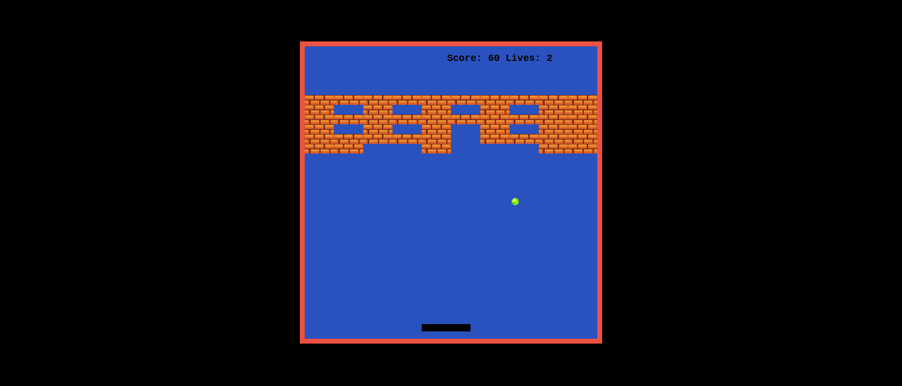

# Breakout

> This is a browser game developed using javascript and inspired by Atari Inc.'s implementation of the same game



## Built With

- HTML
- CSS
- JavaScript

## Live Demo

[Live Demo Link](https://felix45.github.io/Breakout/)

## Getting Started

To get a local copy up and running follow these simple example steps.

### Prerequisites
```
  node js
  npm

```
### Setup
Clone the repository and change the directory to breakout

``` 
  $ git clone git@github.com:Felix45/breakout.git

  $ cd breakout

```

### Install
Install all project dependencies by running the command below
 
``` 
  $ npm install
```
### Usage
Start the http application server
``` 
  $ http-server
```

### Deployment
- [Visit Application Homepage](http://localhost:8080)


### Authors

| 👤 Name | Github | Twitter | LinkedIn |
|------|--------|---------|----------|
|Felix Ouma|[@Felix45](https://github.com/Felix45)|[@Felix_Atonoh](https://twitter.com/Felix_Atonoh)|[LinkedIn](https://www.linkedin.com/in/felix-ouma-639766b0/)|


## 🤝 Contributing

Contributions, issues, and feature requests are welcome!

Feel free to check the [issues page](https://github.com/Felix45/breakout/issues).

## Show your support

Give a ⭐️ if you like this project!

## Acknowledgments
- :heart: Special thanks to my late mum :heart: for buying me my first[Brick Game](https://bit.ly/3ueMaip)
- Hat tip to [Microverse](https://bit.ly/MicroverseTN) for helping me keep the coding fire burning
- Hat tip to [MixKit](https://mixkit.co/free-sound-effects/game/) for free game sound effects used in this project
- Hat tip to [Freecodecamp Channel](https://www.youtube.com/c/Freecodecamp) for wonderful game tutorials used in this project


## 📝 License

This project is [MIT](https://github.com/git/git-scm.com/blob/main/MIT-LICENSE.txt) licensed.